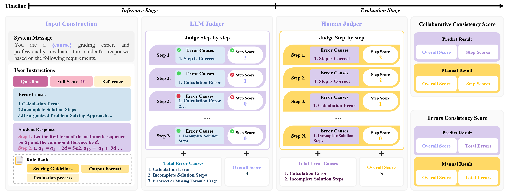

<p align="center">
    
    <p align="center">
        <a href="https://github.com/PKU-DAIR">
            
        </a>
        <a href="https://github.com/PKU-DAIR/SAS-Bench">
            
        </a>
        <a href="https://github.com/PKU-DAIR/SAS-Bench">
            
        </a>
    </p>
</p>

## SAS-Bench: A Fine-Grained Benchmark for Evaluating Short Answer Scoring with Large Language Models

[Dataset](https://huggingface.co/datasets/aleversn/SAS-Bench) | [中文](./docs/Readme_cn.md) | [Paper](https://arxiv.org/pdf/2505.07247) | [Code](https://github.com/PKU-DAIR/SAS-Bench)

## 🔍 Overview

SAS-Bench represents the first specialized benchmark for evaluating Large Language Models (LLMs) on Short Answer Scoring (SAS) tasks. Utilizing authentic questions from China's National College Entrance Examination (Gaokao), our benchmark offers:

- **1,030 questions** spanning 9 academic disciplines
- **4,109 expert-annotated student responses**
- **Step-wise scoring** with **Step-wise error analysis**
- **Multi-dimensional evaluation** (holistic scoring, step-wise scoring, and error diagnosis consistency)

## 🚀 Key Features

### Advancing Beyond Traditional SAS Limitations
SAS-Bench addresses critical limitations of conventional SAS systems:

| Aspect                     | Traditional SAS               | SAS-Bench Advantage                         |
| -------------------------- | ----------------------------- | -------------------------------------------- |
| **Evaluation Granularity** | Single composite score        | Step-wise scoring decomposition             |
| **Explainability**         | Opaque scoring mechanism      | Comprehensive error taxonomy                |
| **Response Diversity**     | Single-subject/type focus     | Cross-disciplinary template-free evaluation |

### Dataset Characteristics

<p align="center">
    
</p>

Our dataset features three question types with rich annotations:

1. **Multiple-Choice Questions** (Template-free responses)
2. **Gap Filling Questions**
3. **Short Answer Questions** (With logical step decomposition)

Each response includes:
- ✅ Human-annotated holistic score
- 🔍 Step segmentation with individual scoring
- ❌ Step-wise Error causes classification

## 🌟 Evaluation Framework

### CCS Evaluation (Collaborative Consistency Score)

**Purpose**  
Evaluates alignment between model predictions and human grading on both *holistic scores* and *step-wise scores*, ensuring models understand detailed reasoning.

**Formula**  
The adjusted weight matrix combines overall and step-wise differences:
```math
W_{i,j} = \alpha \cdot \frac{(r_i - r_j)^2}{(N_r - 1)^2} + \frac{1 - \alpha}{m} \sum_{k=1}^{m} \frac{(s_{i,k} - s_{j,k})^2}{(N_{s_k} - 1)^2}
```
Where:  
- $r_i, r_j$: Model/human overall scores  
- $s_{i,k}, s_{j,k}$: Step scores for step $k$  
- $\alpha=0.5$: Balance weight  
- $N_r, N_{s_k}$: Possible score levels  

Final CCS calculation:
```math
\text{CCS} := 1 - \frac{\sum_{i,j} O_{i,j} \cdot W_{i,j}}{\sum_{i,j} E_{i,j} \cdot W_{i,j}}
```


### ECS Evaluation (Error Consistency Score)

**Purpose**  
Quantifies how well the model identifies error types compared to human annotators, stratified by answer quality tiers.

**Formula**  
1. Partition samples into 3 groups (Low/Medium/High) using quantile thresholds $\tau_1, \tau_2$:
```math
\phi(x) = \mathbb{I}(x \geq \tau_1) + \mathbb{I}(x \geq \tau_2)
```
2. Compute error frequency matrices $ \mathbf{M}^p_k, \mathbf{M}^g_k $ per group $ k $
3. Calculate Spearman correlation per group:
```math
\rho_k = \text{SpearmanR}(\mathbf{M}^p_k, \mathbf{M}^g_k)
```
Final ECS:
```math
\text{ECS} := \frac{1}{m} \sum_{k=0}^{2} \rho_k
```

**Key Features**  
- Uses **3 performance tiers** (m=3) for robust evaluation  
- Correlates **error type distributions** (not just counts)  
- Normalized scoring for cross-dataset comparison

## ⚙️ Installation Guide

### Core Dependencies
```bash
pip install protobuf transformers>=4.44.1 cpm_kernels torch>=2.0 gradio mdtex2html sentencepiece accelerate json_repair openai
```

Alternative:
```bash
pip install -r requirements.txt
```

### vLLM Setup (Recommended)
```bash
conda create -n vllm python=3.12 -y
conda activate vllm
pip install vllm  # Requires CUDA 12.0+
```

For other configurations, refer to official [vLLM installation](https://docs.vllm.ai/en/latest/getting_started/installation/gpu.html).

## 📊 Benchmark Workflow



### Directory Structure
```
|- discuss/        - Analysis scripts
|- docs/           - Documentation assets 
|- main/           - Model training/inference code
|- prompts/        - Predefined prompt templates
|- sas_pipelines/  - Core evaluation scripts
|- utils/          - Utility functions
```

### Implementation Options

#### 0. Data Preprocessing (Annotation Phase)
- Raw annotated data resides in `backend_data`
- Execute `preprocess.py` for data consolidation
- Modify `DATANAME` variable to specify source files (omit extensions)

> This process handles raw data from our annotation system (our system to be open-sourced).

#### 1. Data Acquisition
The dataset is available on [HuggingFace Dataset](https://huggingface.co/datasets/aleversn/SAS-Bench). Store downloaded files in `datasets/`:
- Files follow `{q_id}_{course}_{question_type}.jsonl` naming
- Error taxonomy in `error_type.jsonl`:
  ```json
  {"q_id": 2, "course": "", "question_type": "", "guideline": "", "errors": [{"name": "", "description": ""}...]}
  ```
- `ID_Dict.json` contains subject-ID mappings

#### 2. LLM Prediction
Flexible execution via Jupyter or CLI:

**Option A: Jupyter Notebook**
- Set `cmd_args = False` in `1_predict_scores.py`
- Configure:
  - `save_type_name`: Model identifier/output prefix
  - `model_from_pretrained`: Model path
  - `file_name`: Dataset identifier (e.g., `7_Math_ShortAns`)

**Option B: Command Line**
Set `cmd_args = True`

*Using vLLM (Recommended)*:
```bash
cd sas_pipelines/
python 1_predict_scores.py --file_name=6_Chinese_ShortAns --save_type_name=<model_id> --model_from_pretrained=<path> --batch_size=1000 --vllm=1
```

*With Tensor Parallelism*:
```bash
python 1_predict_scores.py --n_gpu=0,1 --file_name=6_Chinese_ShortAns --save_type_name=<model_id> --model_from_pretrained=<path> --batch_size=1000 --vllm=1 --tensor_parallel_size=2
```

*HuggingFace Predictor*:
```bash
python 1_predict_scores.py --file_name=6_Chinese_ShortAns --save_type_name=<model_id> --model_from_pretrained=<path> --batch_size=5
```

*OpenAI API Predictor*:
1. Create `api_key.txt` in `sas_pipeline/` with format:
   ```text
   OpenAI <API_KEY>
   Deepseek <API_KEY>
   ```
2. Execute:
   ```bash
   python 1_predict_scores.py --file_name=6_Chinese_ShortAns --llm_name=deepseek-chat --save_type_name=Deepseek_V3
   ```

**Additional Parameters**:
- Few-shot learning: `--few_shot_num >0`
- Disable guidelines: `--use_guideline=0`
- Skip reasoning: `--skip_thinking=1`
- `llm_name` defaults to `save_type_name` except for GLM3/OpenAI models

#### 3. Prediction Processing
**Option A: Jupyter**
- Set `cmd_args = False` in `2_process_prediction.py`
- Configure `file_name` (use `all` for batch processing)

**Option B: CLI**
```bash
python 2_process_prediction.py --file_name=all
```

#### 4. CCS Computation
**Option A: Jupyter**
- Configure `file_name` and `save_type_name` in `3_compute_ccs.py`

**Option B: CLI**
```bash
python 3_compute_ccs.py --save_type_name=<model_prefix>
```

#### 5. ECS Computation
**Option A: Jupyter**
- Adjust parameters in `4_compute_ecs.py`

**Option B: CLI**
```bash
python 4_compute_ecs.py --save_type_name=<model_prefix>
```

## 📈 Model Performance Insights

Our experiments with 16 LLMs reveal:

- QWK


- CCS

| Models                     | Phy. (S.) | Phy. (M.) | His. (S.) | Geo. (S.) | Bio. (G.) | Chi. (G.) | Chi. (S.) | Math (S.) | Math (G.) | Pol. (S.) | Eng. (G.) | Che. (G.) | Avg.   |
|----------------------------|-----------|-----------|-----------|-----------|-----------|-----------|-----------|-----------|-----------|-----------|-----------|-----------|--------|
| Deepseek-R1                | 38.43     | **95.01** | **80.98** | 67.92     | **79.12** | 95.09     | 69.07     | 57.85     | **83.56** | 71.92     | 73.19     | 72.92     | 73.76  |
| QwQ-32B                    | 48.53     | 87.23     | 75.43     | **77.06** | 72.52     | **96.00** | 31.77     | 48.66     | 45.51     | 74.48     | 54.79     | 62.17     | 64.51  |
| TinyR1-32B-Preview         | 38.17     | 84.88     | 75.83     | 71.52     | 73.45     | 92.57     | 52.61     | 48.28     | 74.77     | 70.70     | 57.92     | 41.37     | 65.17  |
| Qwen3-32B                  | 47.29     | 85.51     | 64.96     | 80.43     | 63.15     | 92.21     | 50.43     | 51.26     | 80.77     | 73.30     | 59.33     | 57.82     | 67.20  |
| Qwen3-8B                   | 54.33     | 76.17     | 45.54     | 68.89     | 43.22     | 86.01     | 42.02     | 46.33     | 73.33     | 64.25     | 50.55     | 50.52     | 58.43  |
| MiMo-7B-RL                 | 52.77     | 41.01     | 61.33     | 67.10     | 35.93     | 54.72     | 43.09     | 38.09     | 55.79     | 36.78     | 34.69     | 31.05     | 46.03  |
| Deepseek-Prover-V2-7B      | 22.59     | 10.75     | 2.92      | 30.71     | 50.63     | 55.48     | 12.95     | 0.87      | 2.29      | 10.44     | 30.19     | 28.76     | 21.55  |
| DeepSeek-R1-Distill-7B     | 33.71     | 29.24     | 50.92     | 32.35     | 52.18     | 52.44     | 44.29     | 29.52     | 39.55     | 53.77     | 32.98     | 34.27     | 40.44  |
| Deepseek-V3                | 53.89     | 85.72     | 69.85     | 76.23     | 76.51     | 93.42     | **69.49** | **58.81** | 80.18     | **76.75** | **73.82** | **74.64** | **74.11** |
| GPT 4o-mini-20240718       | **58.90** | 81.19     | 54.85     | 76.59     | 65.39     | 87.65     | 55.25     | 43.56     | 37.38     | 63.44     | 22.60     | 55.98     | 58.56  |
| Llama3.3-70B-Instruct      | 45.34     | 70.03     | 72.02     | 72.51     | 67.94     | 85.30     | 35.83     | 58.60     | 74.97     | 63.68     | 67.60     | 38.94     | 62.73  |
| Mixtral 8×7B-Instruct      | 30.78     | 42.27     | 33.43     | 4.99      | 44.45     | 29.85     | 24.00     | 26.73     | 70.04     | 43.92     | 33.40     | 42.05     | 35.49  |
| Qwen2.5-32B-Instruct       | 40.53     | 77.02     | 62.34     | 74.50     | 72.07     | 94.85     | 66.37     | 50.08     | 32.59     | 64.09     | 53.35     | 62.87     | 62.56  |
| Qwen2.5-14B-Instruct       | 53.76     | 66.12     | 60.96     | 74.30     | 67.50     | 92.81     | 63.08     | 43.28     | 75.62     | 62.03     | 56.34     | 57.53     | 64.44  |
| GLM4-9B-Chat               | 45.62     | 52.33     | 36.81     | 69.41     | 39.19     | 63.92     | 42.94     | 35.50     | 56.95     | 54.83     | 33.92     | 30.79     | 46.85  |
| Llama3-8B-Instruct         | 41.09     | 35.10     | 37.52     | 31.29     | 32.19     | 38.13     | 32.89     | 23.55     | 62.43     | 37.78     | 31.68     | 29.27     | 36.08  |

- ECS

| Models                     | Phy. (S.) | Phy. (M.) | His. (S.) | Geo. (S.) | Bio. (G.) | Chi. (G.) | Chi. (S.) | Math (S.) | Math (G.) | Pol. (S.) | Eng. (G.) | Che. (G.) | Avg.   |
|----------------------------|-----------|-----------|-----------|-----------|-----------|-----------|-----------|-----------|-----------|-----------|-----------|-----------|--------|
| Deepseek-R1                | 23.25     | 30.59     | 57.53     | 56.08     | 69.20     | 86.04     | 72.68     | **94.29** | 15.20     | 65.56     | _18.65_   | _81.76_   | **55.90** |
| QwQ-32B                    | 4.74      | **63.92** | 67.06     | _70.04_   | 53.68     | 51.08     | 69.20     | 79.05     | 16.82     | 48.81     | -22.53    | 48.94     | 45.90   |
| TinyR1-32B-Preview         | 3.10      | **63.92** | 65.71     | **77.02** | 56.61     | 64.42     | 74.83     | 82.86     | 23.33     | 40.17     | -31.52    | 17.35     | 44.82   |
| Qwen3-32B                  | -4.17     | 24.18     | _69.52_   | 54.29     | 53.67     | 52.70     | 47.31     | 82.21     | 18.33     | 62.14     | -26.99    | 36.27     | 39.12   |
| Qwen3-8B                   | 23.39     | **63.92** | 14.29     | -4.96     | 52.21     | 47.75     | 34.01     | 39.20     | -8.14     | 57.19     | -27.13    | 59.28     | 29.25   |
| MiMo-7B-RL                 | **51.05** | 24.18     | 14.29     | 38.85     | 58.35     | _92.17_   | 63.07     | 13.39     | 35.12     | -27.10    | -4.41     | 1.04      | 30.00   |
| Deepseek-Prover-V2-7B      | -24.10    | -5.20     | 42.86     | -6.23     | 29.54     | -80.81    | 23.25     | 46.67     | -1.51     | -58.64    | -45.23    | -21.91    | -8.44   |
| DeepSeek-R1-Distill-7B     | -45.19    | 24.18     | 0.95      | -38.66    | 23.55     | -20.36    | 3.87      | -23.81    | -13.57    | -18.81    | -19.59    | -44.58    | -14.34  |
| Deepseek-V3                | 7.79      | 46.58     | 58.10     | 32.62     | _72.38_   | **96.58** | 57.43     | _92.38_   | _33.33_   | 40.26     | **24.77** | **85.83** | _54.00_ |
| GPT 4o-mini-20240718       | 17.91     | 24.18     | 62.14     | 36.68     | 55.20     | 79.01     | **78.00** | 67.62     | **46.90** | **92.31** | 10.04     | 36.39     | 50.53   |
| Llama3.3-70B-Instruct      | 22.56     | _57.35_   | 54.29     | 42.11     | 45.09     | 52.70     | 46.25     | 54.29     | 30.00     | 58.81     | -12.53    | -15.83    | 36.26   |
| Mixtral 8×7B-Instruct      | 11.99     | 17.34     | **80.38** | 35.84     | 32.74     | 42.77     | 75.82     | 56.19     | 30.00     | 6.84      | -31.16    | -7.18     | 29.30   |
| Qwen2.5-32B-Instruct       | 11.95     | 17.41     | 53.33     | 59.34     | 62.96     | 46.90     | 75.08     | 62.86     | 30.00     | 46.67     | -4.50     | 27.08     | 40.76   |
| Qwen2.5-14B-Instruct       | 21.50     | 24.18     | 47.92     | 37.43     | **73.36** | 64.97     | 74.32     | 64.94     | 18.21     | 61.97     | -20.00    | 47.39     | 43.02   |
| GLM4-9B-Chat               | 35.00     | 24.18     | 32.49     | 34.73     | 62.12     | 20.36     | _77.34_   | 63.81     | **46.90** | _82.40_   | -25.35    | 7.18      | 38.43   |
| Llama3-8B-Instruct         | _48.25_   | 27.46     | 17.23     | 31.58     | 61.37     | -14.05    | 41.23     | 57.77     | 21.55     | -69.07    | -26.50    | -27.19    | 14.14   |

## 📅 TO-DO

- [ ] Provide English-localized dataset version
- [ ] Open-source the annotation system (frontend & backend)

## 📜 License
SAS-Bench is released under `Apache License 2.0`. The dataset is available for research purposes only.

> Our questions collect from a publicly available dataset [Gaokao-Bench](https://github.com/OpenLMLab/GAOKAO-Bench) based on China's National College Entrance Examination (Gaokao).

## 📚 Citation
```bibtex
@article{lai2025sasbenchfinegrainedbenchmarkevaluating,
      title={SAS-Bench: A Fine-Grained Benchmark for Evaluating Short Answer Scoring with Large Language Models}, 
      author={Peichao Lai and Kexuan Zhang and Yi Lin and Linyihan Zhang and Feiyang Ye and Jinhao Yan and Yanwei Xu and Conghui He and Yilei Wang and Wentao Zhang and Bin Cui},
      year={2025},
      journal={arXiv preprint arXiv:2505.07247},
      primaryClass={cs.CL},
      url={https://arxiv.org/abs/2505.07247}, 
}
```
